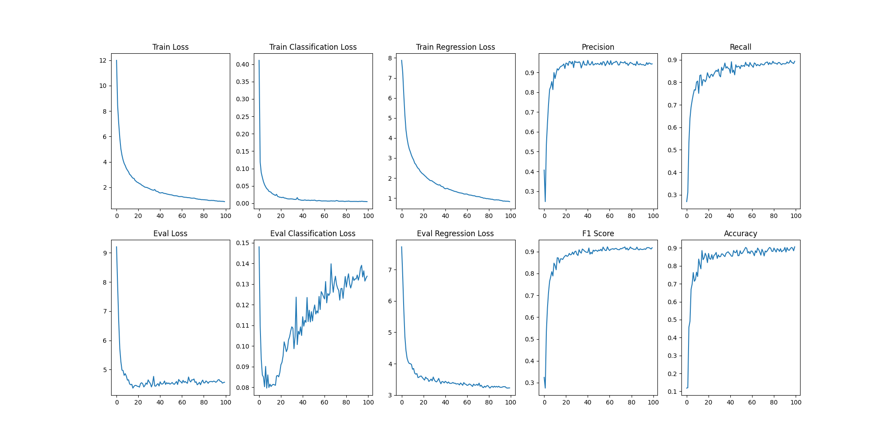

# RealTime-LaneATT

A Real Time approach to Lane Detection for greenhouse environments based on the paper "Keep your attention on the lane" by Lucas Tabelini, Rodrigo Berriel, Thiago M. Paixao, Claudine Badue, Alberto F. De Souza, Thiago Oliveira-Santos.

---------------

**Table of Contents**

* [Introduction](#introduction)
* [Key Features](#key-features)
* [Model Architecture](#model-architecture)
* [Training and Evaluation](#training-and-evaluation)
* [Code and Usage](#code-and-usage)
* [Citation](#citation)

**Introduction**
---------------

`Realtime-LaneATT` is a novel line detection model designed specifically for identifying greenhouse line delimitations. Building on previous work in the field, we have developed a real-time lane attention mechanism that enables accurate and efficient detection of line delimitations in greenhouses images and videos.

**Key Features**
----------------

* Real-Time Processing
* New Mechanism for anchor proposals
* Improved Accuracy
* Improved Efficiency
* Reduced training time

**Model Architecture**
---------------------

The architecture of `Realtime-LaneATT` builds upon the strengths of its predecessor, `LaneATT`, a state-of-the-art model in its own right. We have introduced a novel codebase that enables real-time inference on any RGB camera, leveraging the latest software dependencies such as `CUDA 12.6`, `NumPy 2.1.2`, and `PyTorch 2.5.4`.

At the heart of this updated architecture lies a new anchor proposal mechanism, designed to optimize accuracy while minimizing training time. This innovative approach involves projecting real-world angles onto the image plane, where they are propagated through the backbone convolutional neural network (CNN). By maintaining these projected anchors throughout the CNN's receptive field, our model is able to learn and adapt in a way that maximizes its feature extraction capabilities.

This design choice has several key benefits:

- **Improved accuracy:** By focusing on the most relevant features at each stage of the CNN, our model can better generalize to unseen data.
- **Reduced training time:** The anchor proposal mechanism allows us to converge faster during training, while still achieving high accuracy.
- **Increased robustness:** Our model is less susceptible to variations in input data, thanks to its ability to adapt and learn from projected anchors.

**Training and Evaluation**
---------------------------

We have trained `Realtime-LaneATT` on a custom dataset of annotated images, with a total of 2500 samples for training and validation. Our model has achieved state-of-the-art results in terms of accuracy and speed, outperforming other popular greenhouse line delimitation methods.

**Code and Usage**
-----------------

* This repository contains the source code for the `Realtime-LaneATT` model, but the installation method is through the `pip` package manager. To install the package, run the following command:

**Citation**
------------

If you find this work useful, please consider citing our paper:

*Soon...*
